# Creación de nuestro Addon
Cómo la APT Villa decidimos crear un pequeño recuerdo conmemorativo de nosotros para los eventos, un Addon.

## ¿Qué es un addon?
Un Addon es una placa que que va conectado o se conecta sobre un badge para ser un accesorio más. ¿Cuál es su propósito? Fak no lo sé, se ven cool con los badges y son un recuerdo del evento en el que estuviste.

Pueden existir muchos diseños y todos pueden ser sobre lo que sea, nosotros como Villa que desea enseñar y mostrar lo que hacemos, hemos hecho este pequeño addon cómo un hemblema con el cual las personas puedan recordarnos.

## ¿Cómo se creó este Addon?
Las herramientas principales para la creación de este Addon son los software open source KiCad e Inkscape. 

KiCad es un software de diseño que nos brinda herramientas para generar nuestras propias placas de circuito impreso (PCB's), ayudandonos a generar los esquemáticos y facilitarnos el diseño físico de este.

<center>
   
</center>

Inkscape lo usamos cómo herramienta para la resolución de gráficos y poderlos exportar a nuestro espacio de trabajo en KiCad, generando bordes, figuras y espacios que podemos exportar e integrarlos en el diseño final.

<center>
   
</center>

### 1. Generación de Vectores
Siempre debe iniciar todo desde una idea, inicialmente en la Villa APT pensamos en generar una PCB de multiples colores. Pero por temas economicos y de tiempo, decidimos generar una placa de dos colores (negro y blanco), por lo que la imagen que usamos se convirtió en nuestra referencia.

<center>
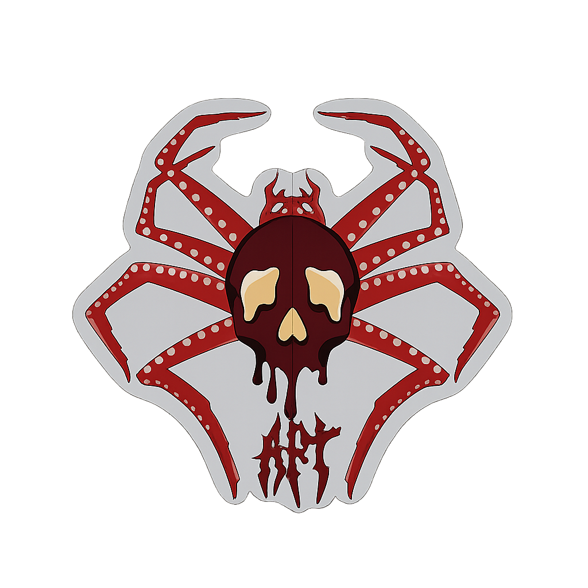   
</center>

Con la imagen ya diseñada, creamos un documento nuevo en Inkscape e importamos nuestra imagen para poder vectorizarla.

<center>
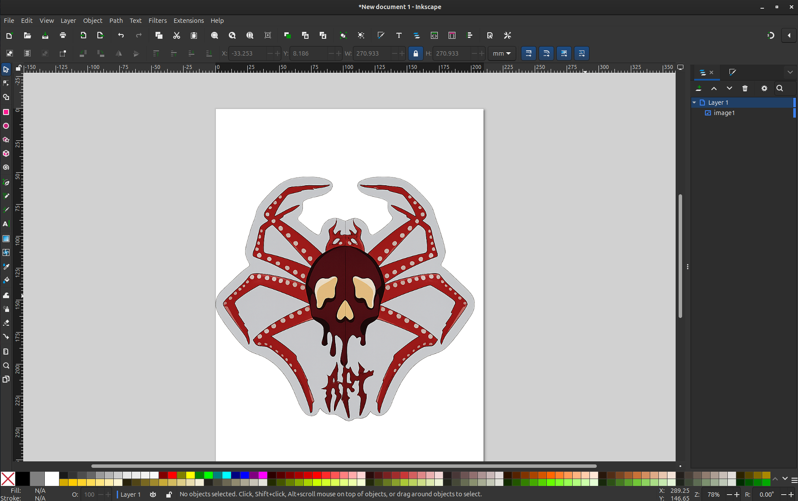   
</center>

Para vectorizar una imagen en Inkscape, nos dirijimos al menú superior y seleccionamos la opción ```Trayecto```, se desplegara una barra y usamos la opción Trazar Mapa de Bits. Esta acción nos desplegara un espacio donde nos ofrece multiples opciones para generar nuestra imagen vectorizada.

<center>
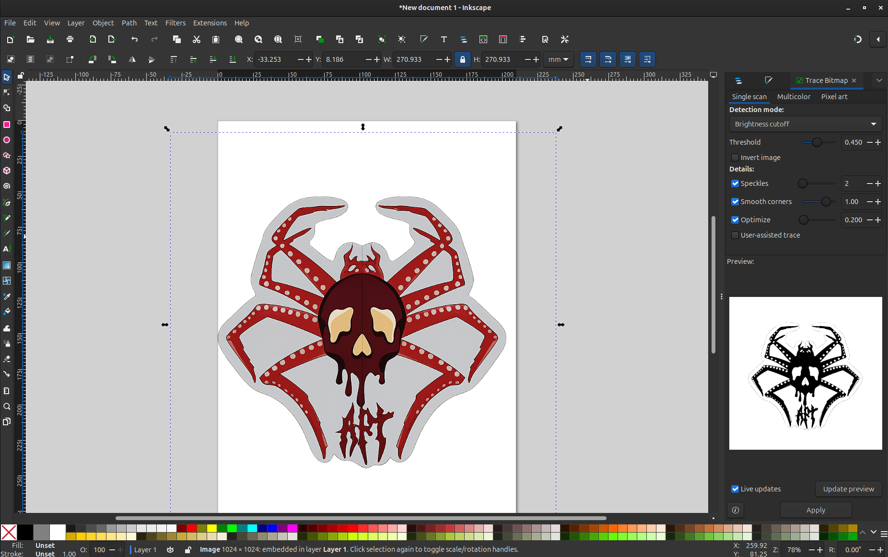   
</center>

Nosotros primeramente obtendremos el borde de nuestra placa y el diseño de corte que llevará. En Inkscape utilizaremos la opción de ```Corte de Brillo```, donde se ajusta el umbral casi al máximo (0.990) para tomar toda la imagen sombreada.

<center>
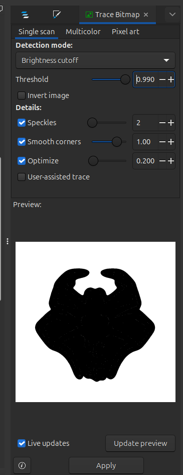   
</center>

Después de aplicar la opción verás que se genera un objeto vectorizado sobre la imagen.

<center>
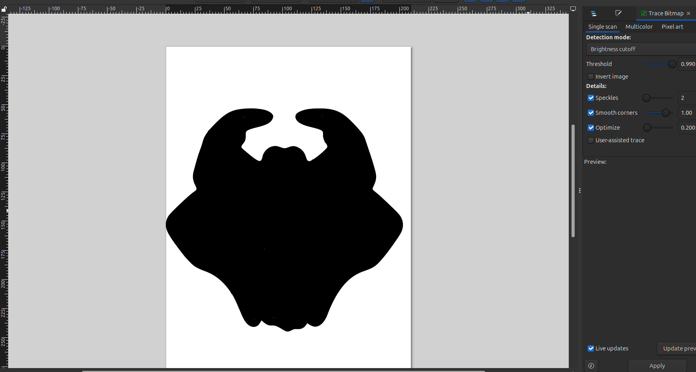   
</center>

En este paso puedes eliminar tu imagen y dejar solo el objeto. Ahora que tienes toda esa área sombreada lo que haremos es modificar sus propiedades de relleno y borde, esta opción la encontramos en el menú que se despliega de la opción ```Objecto``` en la parte superior.

El relleno del objeto lo indicaremos que no lo agregue y el borde, pondremos que se llene de color negro.

<center>
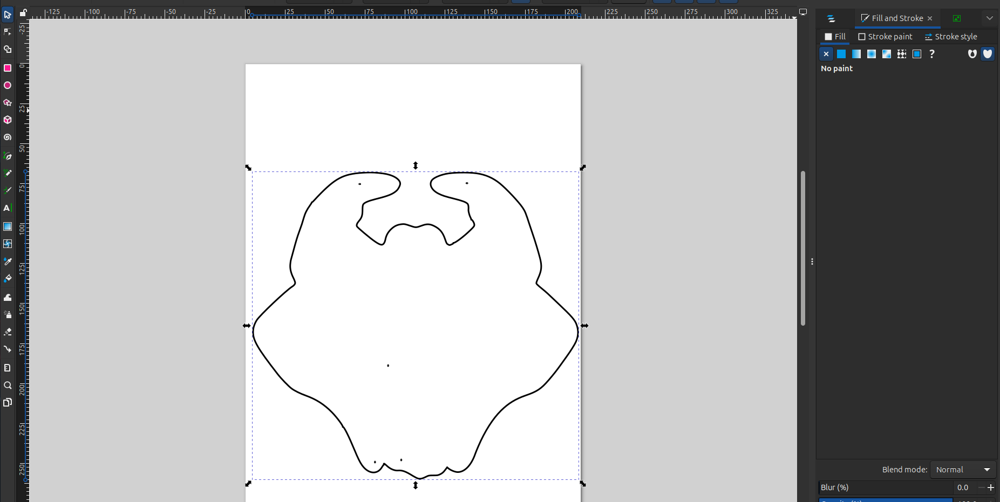   
</center>

Podrás observar que quedaron puntos en el objeto, por lo que tendremos que eliminarlos de manera manual para que no afecte en el diseño de la PCB. Das sobre el objeto doble clic y puedes encerrar esos puntitos para eliminarlos con DELETE o SUPRIMIR.

<center>
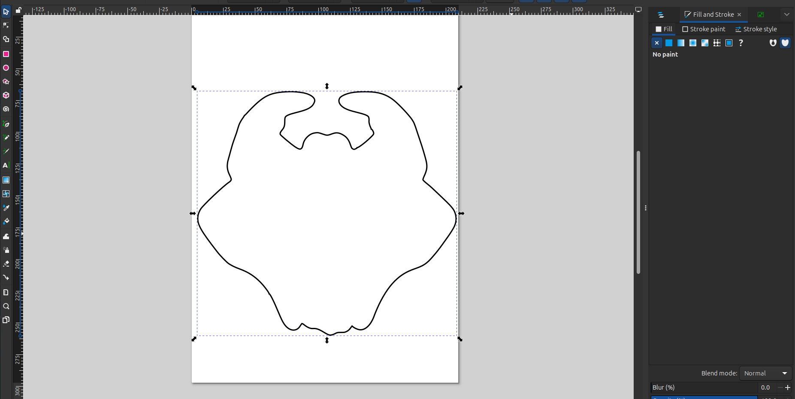   
</center>

Ya eliminados esos puntitos, solo falta ajustar el tamaño del borde. En los Addons el tamaño que deben de tener es de 5x5 cm, por lo que ajustamos nuestras medidas en milimetros. También seleccionamos la opción del candado para que nuestro objeto pueda escalarse proporcionalmente si se modifica alguna medida.

<center>
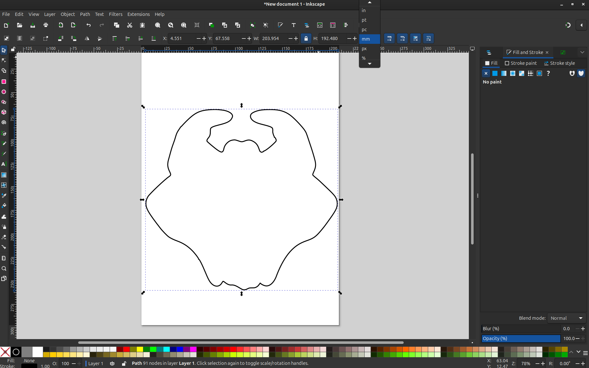   
</center>

Después, en el ancho ponemos la medida a 50 milimetros, con esto se escalara la imagen y verás que se reduce.

<center>
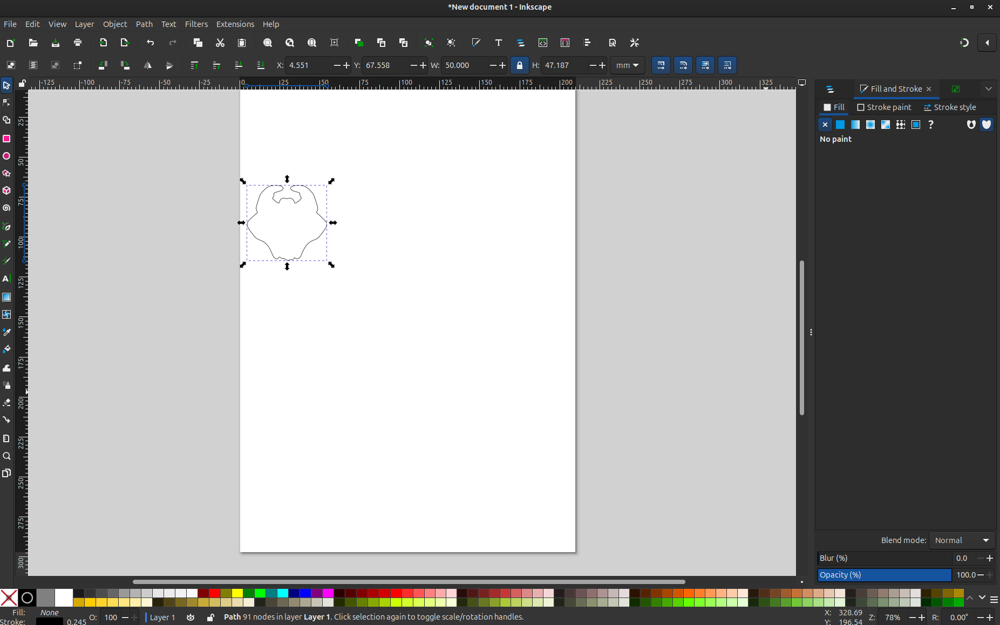   
</center>

Con el objeto seleccionado, nos dirijimos a la opción de ```Archivo``` en la parte superior. En el menú que se despliegue seleccionamos Propiedades del Documento y nos abrirá una ventana.

Vamos al iconó de ajustar tamaño (dónde dice Redimensionar al contenido). Al dar clic verás como se reduce el tamaño del espacio de trabajo y se ajusta al objeto.

<center>
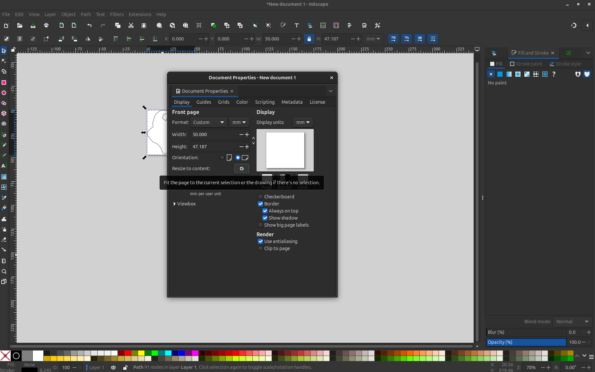   
</center>

Ya con todas las acciones realizadas, guardamos el documento, es necesario que se guarde en archivo ```.svg```.

<center>
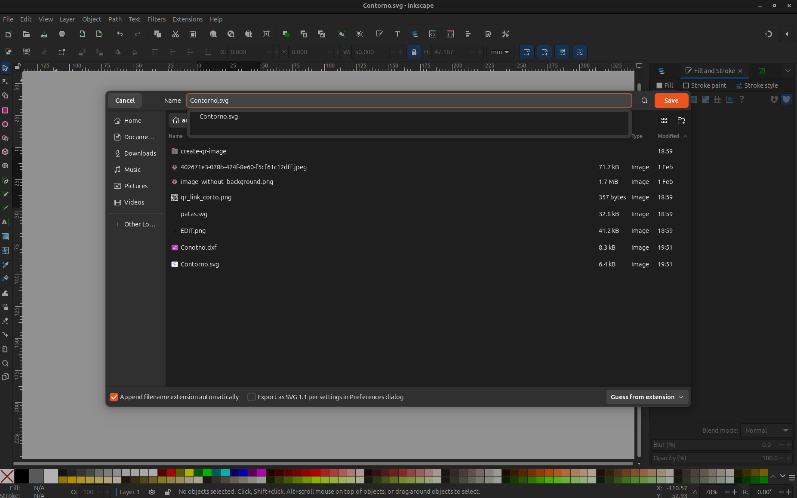   
</center>

Con esto podemos pasar al espacio de trabajo de KiCad.

### 2. Exportación de Gráficos a KiCad

Abrimos nuestro espacio de trabajo en Kicad, la versión con la que se trabajó el diseño de la PCB es KiCad 9. Observarás que tenemos varias selecciones, nosotros vamos a ir a ```Editor de PCB```, ahí trabajaremos con todos los gráficos que se vayan a ver físicamente.

<center>
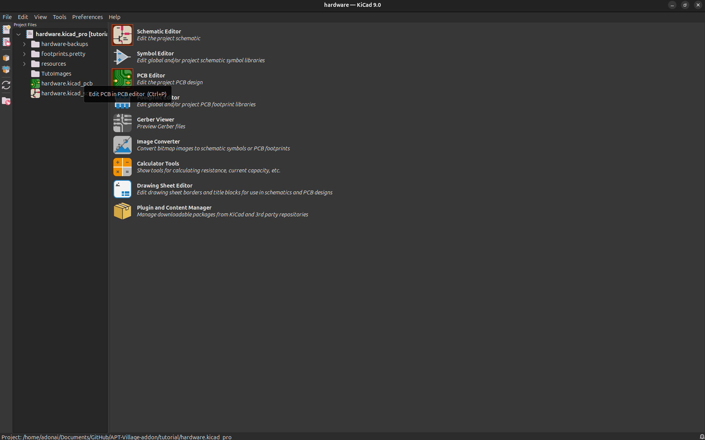   
</center>

Cuando se abra el editor, observaremos el espacio de trabajo de KiCad para diseño de PCB. Es un espacio con fondo negro cuadriculado.

<center>
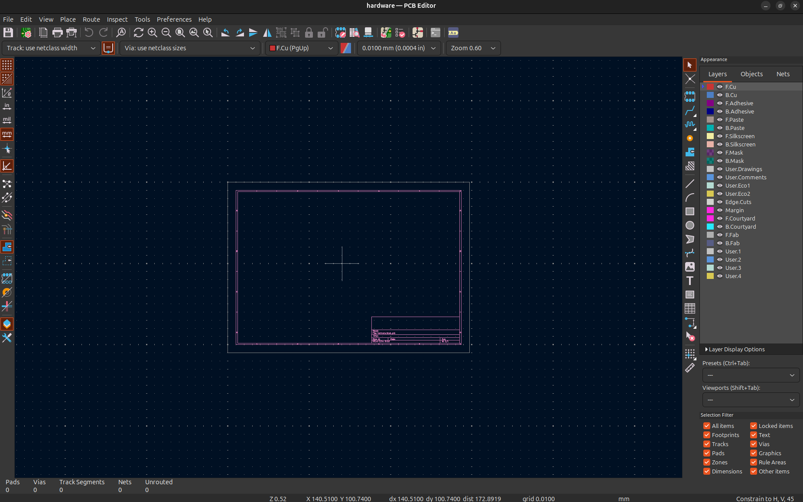   
</center>

Ahora podemos importar el gráfico que generamos en Inkscape. Para realizarlo debes ir al menú superior y presionar la pestaña de ```Archivo```
dirigirte a ```Importar``` en el menú desplegable y seleccionar ```gráfico```.

<center>
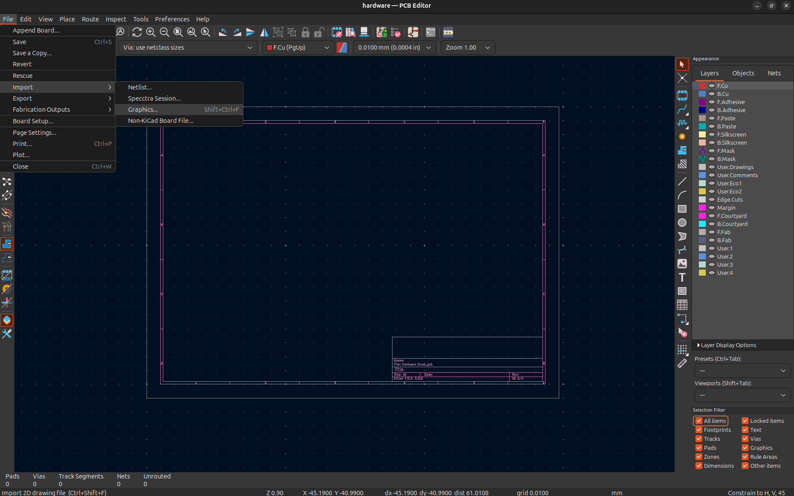   
</center>

Se abrirá una ventana, tienes que seleccionar la ruta del gráfico que desees agregar, en nuestra situación es el "contorno.svg" que creamos. Debemos fijarnos en que capa deseamos importarlo, al ser el contorno de corte para la PCB, seleccionamos la capa ```Edge Cuts```.

<center>
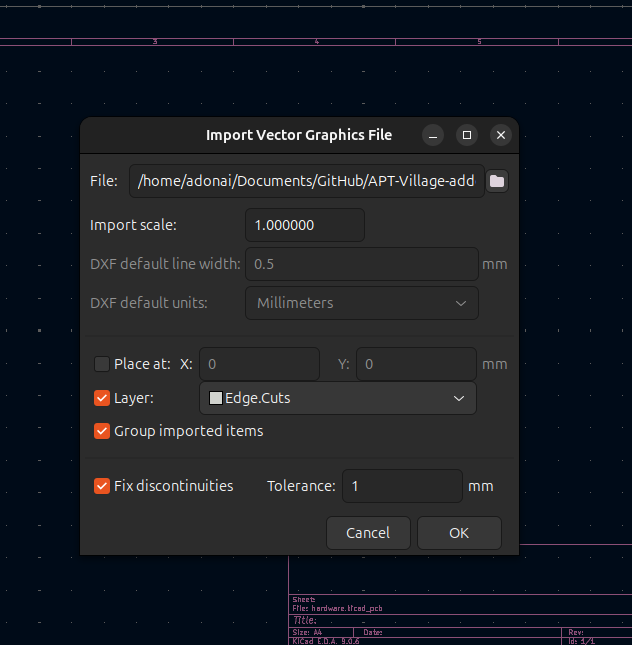   
</center>

Una vez aplicado, veremos cómo el contorno aparece en nuestro espacio de trabajo.

<center>
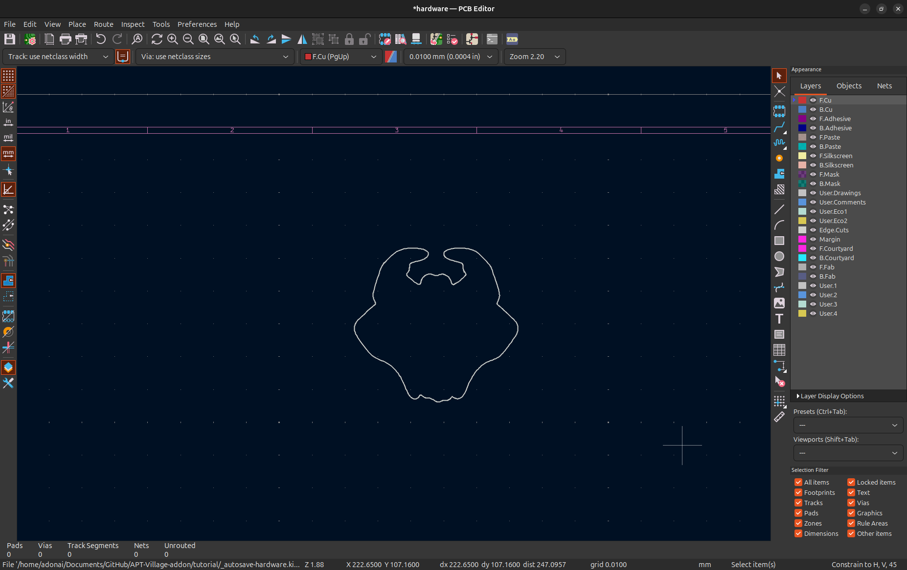   
</center>

Para verificar que el gráfico esté correctamente hecho y que los cortes no sean trazos que KiCad no soporte generar, abriremos el visor 3D. Podemos abrirlo dirigiendonos a la parte superior de la ventana y seleccionando el icono que parece un capacitor. Sino puedes presionar las teclas ALT+3.

<center>
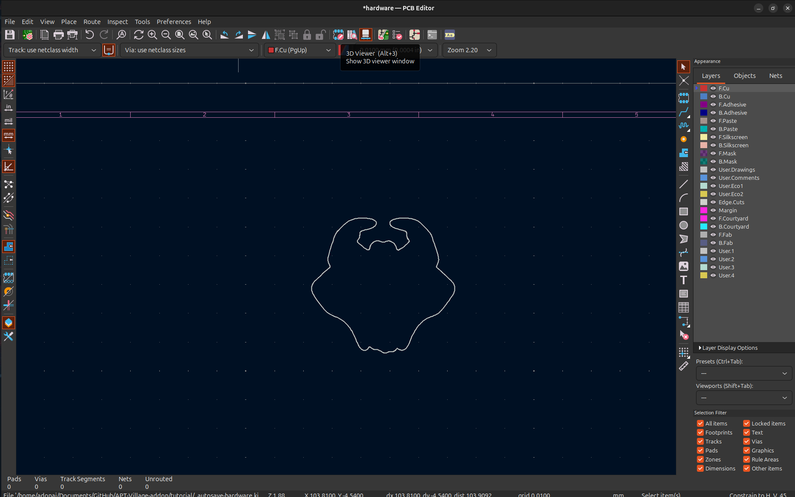   
</center>

Si tu placa, en el visor 3D no tiene la forma de la figura, quiere decir que los cortes están mal, de otro modo todo es correcto y la placa tiene la forma deseada.

<center>
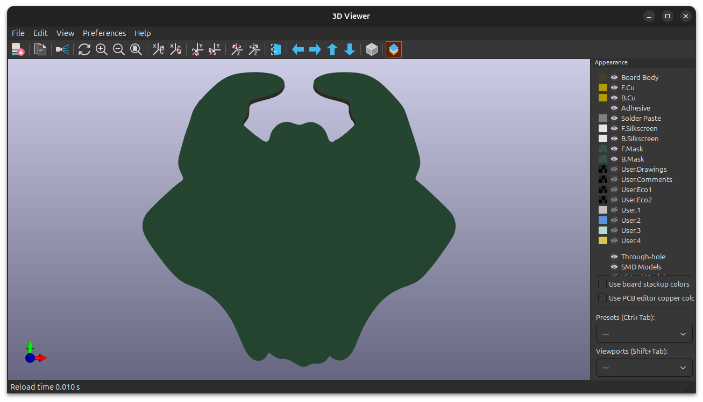   
</center>


