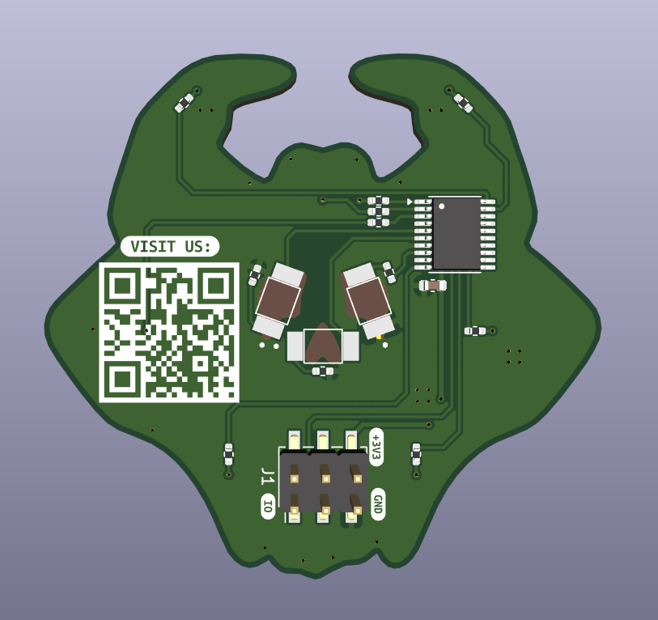
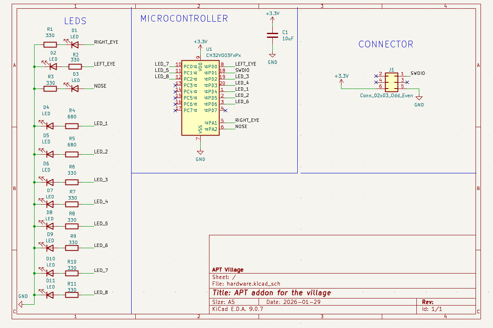
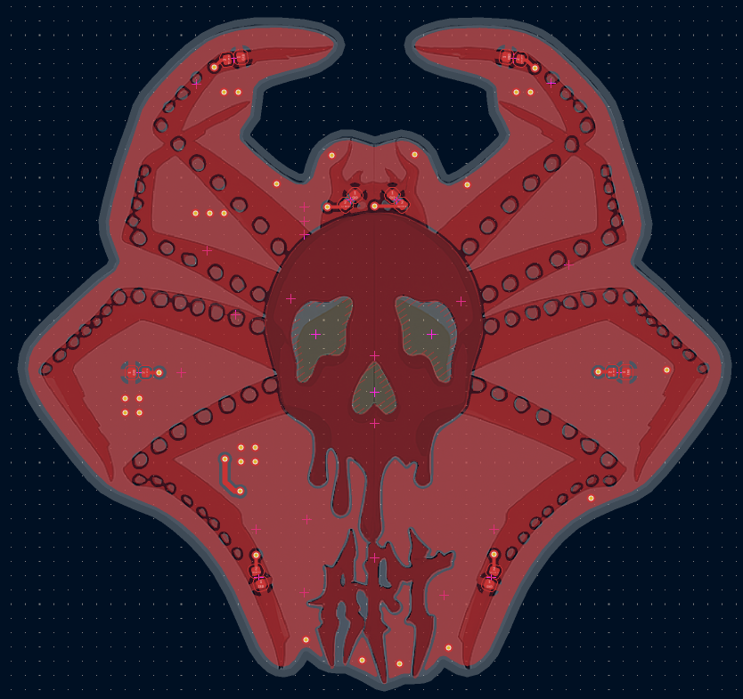
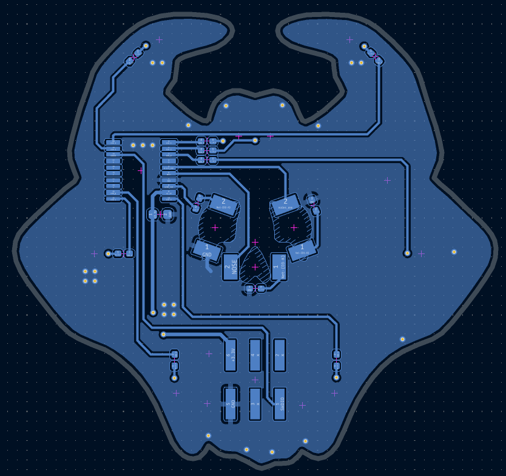

# Creación de nuestro Addon
Cómo la APT Villa decidimos crear un pequeño recuerdo conmemorativo de nosotros para los eventos, un Addon.

## ¿Qué es un addon?
Un Addon es una placa que que va conectado o se conecta sobre un badge para ser un accesorio más. ¿Cuál es su propósito? Fak no lo sé, se ven cool con los badges y son un recuerdo del evento en el que estuviste.

Pueden existir muchos diseños y todos pueden ser sobre lo que sea, nosotros como Villa que desea enseñar y mostrar lo que hacemos, hemos hecho este pequeño addon cómo un hemblema con el cual las personas puedan recordarnos.

## ¿Cómo se creó este Addon?
Las herramientas principales para la creación de este Addon son los software open source KiCad e Inkscape. 

KiCad es un software de diseño que nos brinda herramientas para generar nuestras propias placas de circuito impreso (PCB's), ayudandonos a generar los esquemáticos y facilitarnos el diseño físico de este.

<p align=p align=center>
   
</p>

Inkscape lo usamos cómo herramienta para la resolución de gráficos y poderlos exportar a nuestro espacio de trabajo en KiCad, generando bordes, figuras y espacios que podemos exportar e integrarlos en el diseño final.

<p align=center>
   
</p>

### 1. Generación de Vectores
Siempre debe iniciar todo desde una idea, inicialmente en la Villa APT pensamos en generar una PCB de multiples colores. Pero por temas economicos y de tiempo, decidimos generar una placa de dos colores (negro y blanco), por lo que la imagen que usamos se convirtió en nuestra referencia.

<p align=center>
   
</p>

Con la imagen ya diseñada, creamos un documento nuevo en Inkscape e importamos nuestra imagen para poder vectorizarla.

<p align=center>
   
</p>

Para vectorizar una imagen en Inkscape, nos dirijimos al menú superior y seleccionamos la opción ```Trayecto```, se desplegara una barra y usamos la opción Trazar Mapa de Bits. Esta acción nos desplegara un espacio donde nos ofrece multiples opciones para generar nuestra imagen vectorizada.

<p align=center>
   
</p>

Nosotros primeramente obtendremos el borde de nuestra placa y el diseño de corte que llevará. En Inkscape utilizaremos la opción de ```Corte de Brillo```, donde se ajusta el umbral casi al máximo (0.990) para tomar toda la imagen sombreada.

<p align=center>
   
</p>

Después de aplicar la opción verás que se genera un objeto vectorizado sobre la imagen.

<p align=center>
   
</p>

En este paso puedes eliminar tu imagen y dejar solo el objeto. Ahora que tienes toda esa área sombreada lo que haremos es modificar sus propiedades de relleno y borde, esta opción la encontramos en el menú que se despliega de la opción ```Objecto``` en la parte superior.

El relleno del objeto lo indicaremos que no lo agregue y el borde, pondremos que se llene de color negro.

<p align=center>
   
</p>

Podrás observar que quedaron puntos en el objeto, por lo que tendremos que eliminarlos de manera manual para que no afecte en el diseño de la PCB. Das sobre el objeto doble clic y puedes encerrar esos puntitos para eliminarlos con DELETE o SUPRIMIR.

<p align=center>
   
</p>

Ya eliminados esos puntitos, solo falta ajustar el tamaño del borde. En los Addons el tamaño que deben de tener es de 5x5 cm, por lo que ajustamos nuestras medidas en milimetros. También seleccionamos la opción del candado para que nuestro objeto pueda escalarse proporcionalmente si se modifica alguna medida.

<p align=center>
   
</p>

Después, en el ancho ponemos la medida a 50 milimetros, con esto se escalara la imagen y verás que se reduce.

<p align=center>
   
</p>

Con el objeto seleccionado, nos dirijimos a la opción de ```Archivo``` en la parte superior. En el menú que se despliegue seleccionamos Propiedades del Documento y nos abrirá una ventana.

Vamos al iconó de ajustar tamaño (dónde dice Redimensionar al contenido). Al dar clic verás como se reduce el tamaño del espacio de trabajo y se ajusta al objeto.

<p align=center>
   
</p>

Ya con todas las acciones realizadas, guardamos el documento, es necesario que se guarde en archivo ```.svg```.

<p align=center>
   
</p>

Con esto podemos pasar al espacio de trabajo de KiCad.

### 2. Exportación de Gráficos a KiCad

Abrimos nuestro espacio de trabajo en Kicad, la versión con la que se trabajó el diseño de la PCB es KiCad 9. Observarás que tenemos varias selecciones, nosotros vamos a ir a ```Editor de PCB```, ahí trabajaremos con todos los gráficos que se vayan a ver físicamente.

<p align=center>
   
</p>

Cuando se abra el editor, observaremos el espacio de trabajo de KiCad para diseño de PCB. Es un espacio con fondo negro cuadriculado.

<p align=center>
   
</p>

Ahora podemos importar el gráfico que generamos en Inkscape. Para realizarlo debes ir al menú superior y presionar la pestaña de ```Archivo```
dirigirte a ```Importar``` en el menú desplegable y seleccionar ```gráfico```.

<p align=center>
   
</p>

Se abrirá una ventana, tienes que seleccionar la ruta del gráfico que desees agregar, en nuestra situación es el "contorno.svg" que creamos. Debemos fijarnos en que capa deseamos importarlo, al ser el contorno de corte para la PCB, seleccionamos la capa ```Edge Cuts```.

<p align=center>
   
</p>

Una vez aplicado, veremos cómo el contorno aparece en nuestro espacio de trabajo.

<p align=center>
   
</p>

Para verificar que el gráfico esté correctamente hecho y que los cortes no sean trazos que KiCad no soporte generar, abriremos el visor 3D. Podemos abrirlo dirigiendonos a la parte superior de la ventana y seleccionando el icono que parece un capacitor. Sino puedes presionar las teclas ALT+3.

<p align=center>
   
</p>

Si tu placa, en el visor 3D no tiene la forma de la figura, quiere decir que los cortes están mal, de otro modo todo es correcto y la placa tiene la forma deseada.

<p align=center>
   
</p>


### 3. Diseño y Acomodo de componentes en la placa

En la siguientes imagenes podrás observar cómo dejamos los diseños del addon, no se desea a entrar tanto a detalle ya que puede ser un poco tedioso, pero se jugó con los gráficos de la imagen base en la que nos basamos. El resultado fue el siguiente:

<p align=center>
   
</p>

La decisión de acomodar los componentes en cierta posición dependen mucho de la imagen que se agrega y del diseño. Por nuestra parte se optó por poner los leds en las patitas, ojos y a unos costados. 

Para las conexiones entre componentes de manera física, estas dependen de cómo estén conectados en el esquématico, es decir cómo se conectaron sus simbolos de cada led, cada capacitor y con el chip:

<p align=center>
   
</p>

Aunque, también depende de cómo se acomoden en la placa, ya que a veces, para conectar algunos componentes pueda ser complicado y se deba modificar el esquématico para facilitar el trabajo de diseño.

Finalmente, en las conexiones se debe evitar giros de 90 grados (pistas en L), se recomienda que los dobleces sean redondos o a 45 grados. También intentar que las conexiónes sean lo más directas posible, sin tantos cambios de lado de la placa y sin tantos cambios de dirección.

Cómo resultado, las conexiones quedaron de esta manera:

<p align=center>
   
</p>

### 4. Firmware y Programación del ADDON
Para el firmware del Addon usamos el repositorio de [CH32FUN](https://github.com/cnlohr/ch32fun) el cual contiene el recurso para poder compilar y generar los archivos ```.bin``` y ```.hex``` que utilizamos para flashear cada uno de los addons.

No detallaremos algunas cosas de manera técnica ya que sería un poco tedioso para comprender y la idea es qe pueda ser una lectura lo más ligero posible.  

Primeramente con una funcion configuramos el addon para las funciones de hardware que se usan en el código.

```C
void InitAddon()
{
	SystemInit();

    funGpioInitAll();

	timer_init();

    systick_init();

    InitLeds();
}
```

La función inicializa los gpio que se usan, un timer para producir un pwm para el control de la luz de los leds y un systick para el control de delays sin bloquear el procesador del microcontrolador.

En el pwm se genera un callback que se ejecuta cada vez que el timer realice un pulso. Dentro de este, se generan el encendido y apagado de los leds, según el nivel del pwm que se le de en el código ```main``` tendrá un cierto brillo. Igualmente para el control de los leds, se generó una estructura para poder usar el pin único de cada uno y su nivel de pwm.

```C
typedef struct {
    uint8_t led;
    volatile uint16_t pwm;
} led_t;

void TIM1_UP_IRQHandler(void) __attribute__((interrupt));
void TIM1_UP_IRQHandler(void)
{
    if (TIM1->INTFR & TIM_FLAG_Update)
    {
        TIM1->INTFR &= ~TIM_FLAG_Update;

        counter++;

        if (counter >= 1000)
            counter = 0;

        funDigitalWrite(led_1.led, counter<led_1.pwm);
        funDigitalWrite(led_2.led, counter<led_1.pwm);
        funDigitalWrite(led_3.led, counter<led_3.pwm);
        funDigitalWrite(led_4.led, counter<led_4.pwm);
        funDigitalWrite(led_5.led, counter<led_5.pwm);
        funDigitalWrite(led_6.led, counter<led_6.pwm);
        funDigitalWrite(led_7.led, counter<led_7.pwm);
        funDigitalWrite(led_8.led, counter<led_8.pwm);
        funDigitalWrite(led_left.led, counter<led_nose.pwm);
        funDigitalWrite(led_right.led, counter<led_nose.pwm);
        funDigitalWrite(led_nose.led, counter<led_nose.pwm);
    }
}
```

Viendo cómo está definido la función del timer, el brillo de algún led es tan fácil de controlar solo con asignar un valitalWrite(led_6.led, counter<led_6.pwm);
        funDigitalWrite(led_7.led, counter<led_7.pwm);
        funDigitalWrite(led_8.led, counter<led_8.pwm);
        funDigitalWrite(led_left.led, counter<led_nose.pwm);
        funDigitalWrite(led_right.led, counter<led_nose.pwm);
        funDigor de 0-999 en alguna de las estructuras de los leds.

```C
led_1.pwm = 500;
```

Ya conociendo eso se puede usar ya diferentes funciones donde cada cierto tiempo cambie el valor del pwm. Por ejemplo en el siguiente código se ve como se realiza un while loop hasta que se rompe una condición, esta forma de trabajar con el addon se ve continuamente en las secuencias de luces

```C
while (led_1.pwm != 0)
{
    uint32_t current_time = millis();

    if(led_nose.pwm == 1000) pivot_nose_eyes = -20;
    if(led_nose.pwm == 20) pivot_nose_eyes = 20;
    
    if(current_time - last_time_eyes > 50){
        led_1.pwm -= 25;
        last_time_eyes = current_time;
    }

    if(current_time - last_time_nose > 10){
        led_nose.pwm += pivot_nose_eyes;
        last_time_nose = current_time;
    }
}
```

Una vez generada las funciones y secuencias de leds, se agrega en el código  ```main```. De esta manera ya podemos hacer funcionar nuestro ADDON.

```C
int main()
{

	InitAddon(); 

    delay_ms(100);

	while(1)
	{
        sequence();
	}
}
```

### 5. Compilación y Carga de firmware.

Usando el mismo repositorio de [CH32FUN](https://github.com/cnlohr/ch32fun), para compilar el proyecton debemos usar en terminal el comando ```make build```. Nos genera un archivo y podremos usar ```make flash``` para cargar el firmware al addon. 

Para cargar el firmware en el addon es necesario usar un programador que tenga soporte para los chips CH32 o para la arquitectura de ```riscv```. Nosotros recomendamos el programador oficial <b>WCH-Link</b>.

