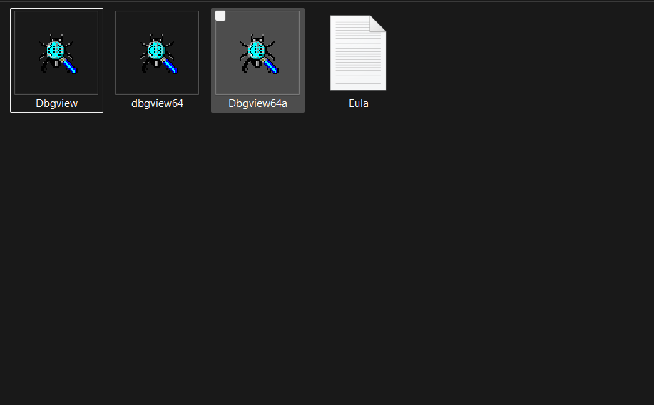
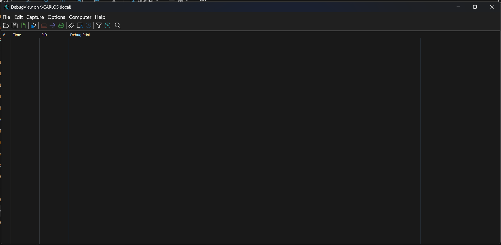
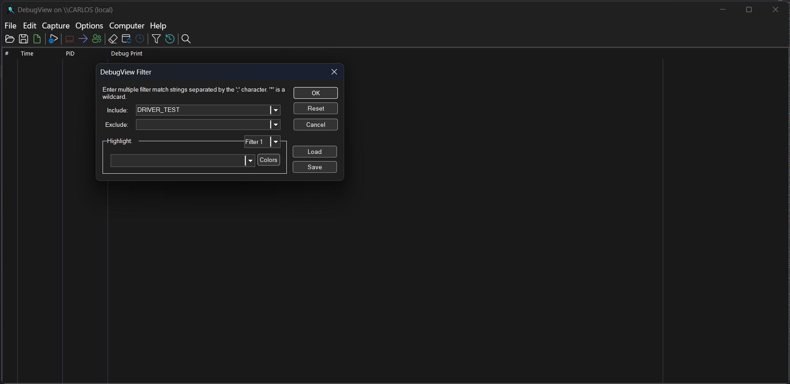
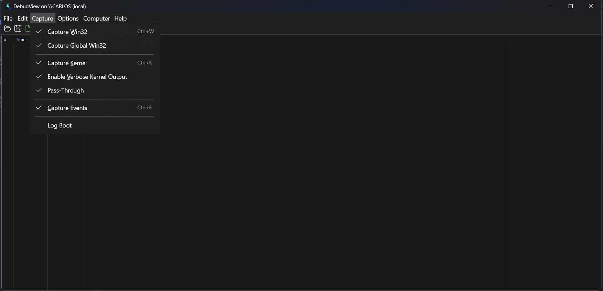
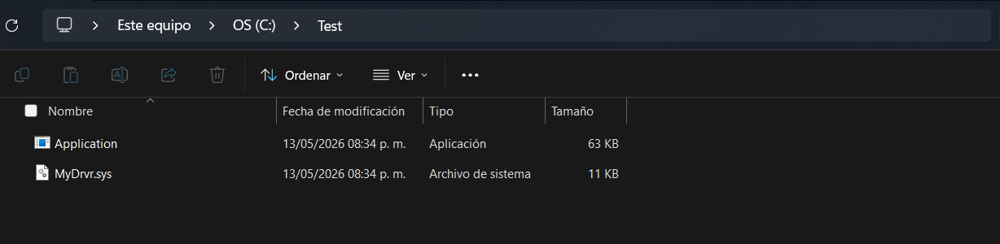
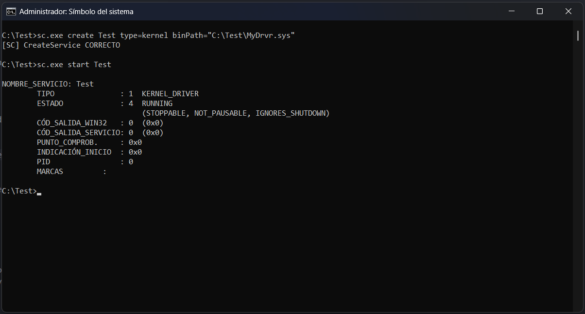
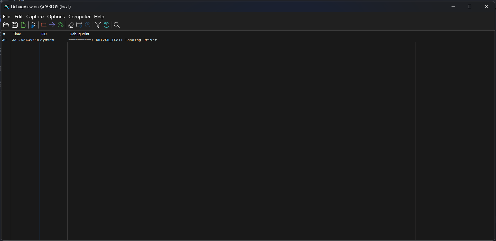
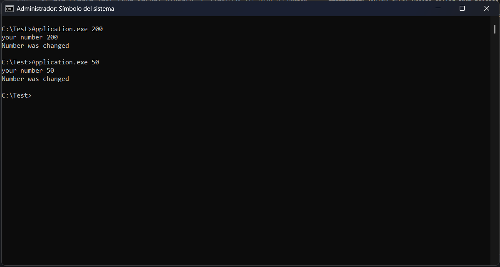
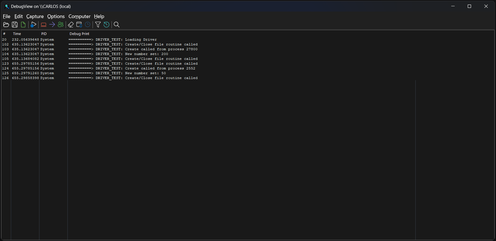
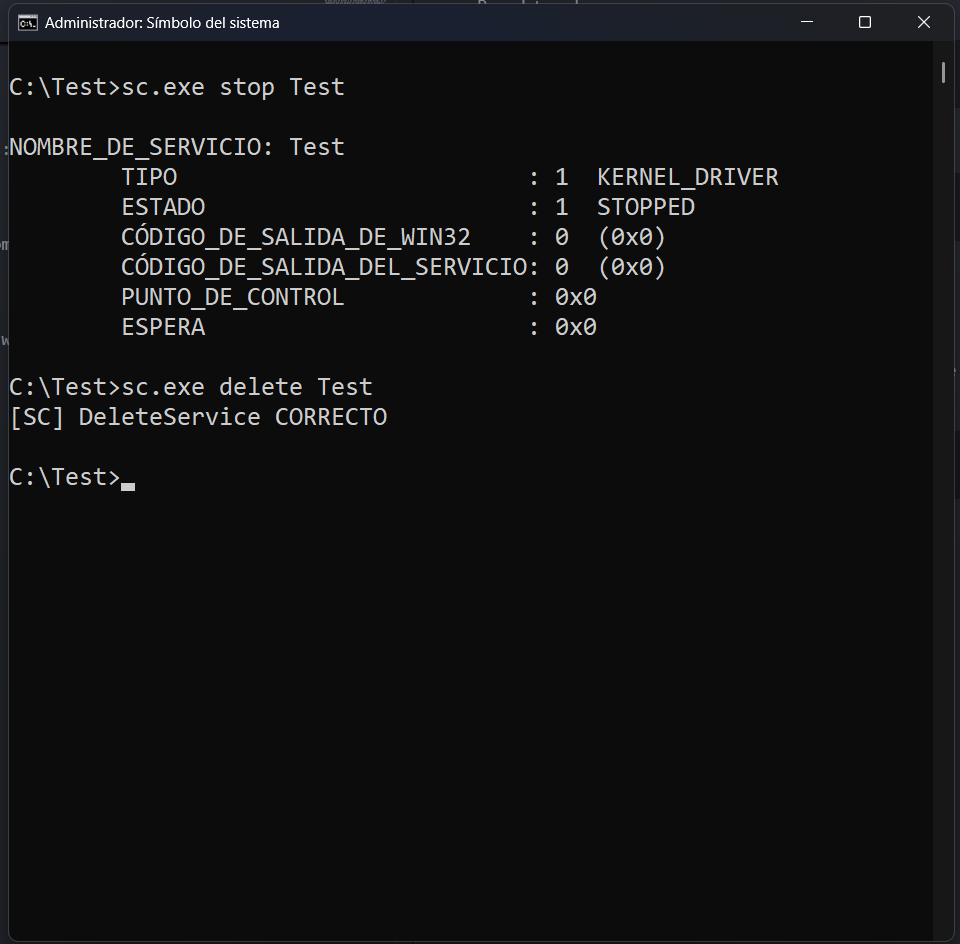

# DRIVERS VULNERABLES

## ¿Qué es un driver?
En este caso un driver o un controlador en modo kernel, es un componente que nos permite la interacción con el hardware y memoria del equipo. 
Estos son usados cómo un traductor entre el hardware y el kernel, son usados principalmente para poder usar hardware cómo dispositivoas usb, para hardware como el stack de internet, etc.

## Pero... ¿por qué pueden ser vulnerables?
Al trabajar directamente a nivel kernel, los drivers tinene un nivel de privilegios "máxima", es decir trabajan a nivel NT-System. Si en algún driver existe algún error de desarrollo puede generar una vulnerabilidad y provocar que el atacante pueda escalar sus privilegios hasta ser NT-System

## Modo Usuario y Modo Kernel
Antes de dar a conocer drivers vulnerables, deseo explicar un poco sobre cómo funcionan y cómo es posible que sean vulnerables desde un punto de vista del desarrollo.

Existen dos modos en windows:
- Modo Usuario
- Modo Kernel

El modo usuario son todas aquellas aplicaciones con las cuales el usuario puede interactuar, estas tienen su propio espacio de memoria virtual con el cual trabajar y no afectan al sistema si alguna aplicación llega a fallar.

El modo kernel, los controladores, servicios y gestionamiento de recursos del equipo, funcionan solamente en kernel, y aquí hay una gran diferencia a las aplicaciones de modo usuario, estos comparten el mismo espacio y si existe algún error en la programación de algún componente en kernel, pueden generar un falla o el conocido "pantalla azul" (BSOD) y afectar al equipo.

## ¿Cómo se puede interactar entre Kernel y Espacio de Usuario?

En cierto punto, el usuario debe hacer uso del hardware ya sea para ingresar información o para poder hacer uso de este. Por ejemplo, ¿Cómo es que logramos ingresar información desde un teclado para que el usuario pueda escribir en pantalla? ¿Cómo es que podemos mover el cursor con nuestro mouse? ¿Incluso cómo es que nos llega los paquetes de internet por medio de nuestra tarjeta de red y sea direccionado a nuestro equipo para su respectiva aplicación en uso?

Para esto quiero explicar algo que se llama DeviceObjects. Estos son "Objetos" que usamos para comunicarnos a ciertos drivers por medio de "buffers" que pueden recibir.

Supongamos que tenemos nuestro driver:

>Este es código de un driver sencillo creado en el kit de desarrollo de windows de KMD en Visual Studio 2022. Dónde se puede compilar el código.


Este es el punto de entrada de nuestro driver, donde definiremos el objeto:

```Cpp 
// El punto de entrada del driver
extern "C"
NTSTATUS DriverEntry(PDRIVER_OBJECT  DriverObject, PUNICODE_STRING RegistryPath)
{

    ...

    return STATUS_SUCCESS; 
}
```

Primero asignamos rutinas al objeto del driver, en estre caso queda de la siguiente manera:

```Cpp
    DriverObject->MajorFunction[IRP_MJ_CREATE] =
        DriverObject->MajorFunction[IRP_MJ_CLOSE] = MySampleObjectCreateClose;

    DriverObject->MajorFunction[IRP_MJ_WRITE] = MySampleObjectWrite;
```

Donde se asigna una funcion de interrupción de creación y cierre, y por último uno de escritura. La rutina de escritura explicaremos más adelante cuál es su función.

Después creamos el objeto con la siguiente función ```IoCreateDevice``` que recibe ciertos parametros:
- El objeto del driver
- El nombre del objeto
- El tipo del obejto 
- El puntero al objeto

Nuestro código quedaría así:
```Cpp
    UNICODE_STRING devName = RTL_CONSTANT_STRING(L"\\Device\\MyDriver");

    PDEVICE_OBJECT DeviceObject;

    status = IoCreateDevice(
        DriverObject,
        0,
        &devName,
        FILE_DEVICE_UNKNOWN,
        0,
        FALSE,
        &DeviceObject
    );
```
Depués generamos el simbolo de enlace con el cual podremos comunicarnos desde un ejecutable:

```Cpp
    UNICODE_STRING symLink = RTL_CONSTANT_STRING(L"\\??\\MyDriver");

    status = IoCreateSymbolicLink(&symLink, &devName);
```


Este código es funcional para poderse comunicar directamente con el sencillo driver que vamos a crear, esto desde alguna aplicación que generemos y que tenga el código para enviar la información a través de los "buffers" IOCTL del objeto.

<details>
<summary>
Código completo del driver
</summary>

```Cpp
#include <Ntifs.h>
#include <ntddk.h>
#include <wdm.h>

#define DRIVER_PREFIX "==========> DRIVER_TEST: " // Prefix for the logs

// Macro to print on kernel
#define PRINT(fmt, ...) \
    DbgPrint(DRIVER_PREFIX fmt "\n", ##__VA_ARGS__)

/* global variables */
ULONG sampleNumber = 0;

/* Unload driver routine */
void UnloadDriver(PDRIVER_OBJECT  DriverObject);

/* Create Close function */
NTSTATUS MySampleObjectCreateClose(PDEVICE_OBJECT DeviceObject, PIRP Irp);

/* Write Fucntion */
NTSTATUS MySampleObjectWrite(PDEVICE_OBJECT DeviceObject, PIRP Irp);

extern "C"
NTSTATUS DriverEntry(PDRIVER_OBJECT  DriverObject, PUNICODE_STRING RegistryPath)
{
    NTSTATUS status = STATUS_SUCCESS;

    UNREFERENCED_PARAMETER(RegistryPath);
    UNREFERENCED_PARAMETER(DriverObject);

    DriverObject->MajorFunction[IRP_MJ_CREATE] =
        DriverObject->MajorFunction[IRP_MJ_CLOSE] = MySampleObjectCreateClose;

    DriverObject->MajorFunction[IRP_MJ_WRITE] = MySampleObjectWrite;

    UNICODE_STRING devName = RTL_CONSTANT_STRING(L"\\Device\\MyDriver");

    PDEVICE_OBJECT DeviceObject;

    status = IoCreateDevice(
        DriverObject,
        0,
        &devName,
        FILE_DEVICE_UNKNOWN,
        0,
        FALSE,
        &DeviceObject
    );

    if (!NT_SUCCESS(status))
    {
        PRINT("Failed Creating device Object (0x%08X)", status);
        return status;
    }

    UNICODE_STRING symLink = RTL_CONSTANT_STRING(L"\\??\\MyDriver");

    status = IoCreateSymbolicLink(&symLink, &devName);

    if (!NT_SUCCESS(status))
    {
        PRINT("Failed Creating link name (0x%08X)", status);
        IoDeleteDevice(DeviceObject);
        return status;
    }

    PRINT("Loading Driver");

    // Set the Unload function for the driver Object
    DriverObject->DriverUnload = UnloadDriver;

    return status;
}

// Routine for Unload the driver
void UnloadDriver(PDRIVER_OBJECT  DriverObject)
{
    UNICODE_STRING symLink = RTL_CONSTANT_STRING(L"\\??\\MyDriver");

    // delete symbolic link
    IoDeleteSymbolicLink(&symLink);

    // delete device object
    IoDeleteDevice(DriverObject->DeviceObject);

    PRINT("DRIVER UNLOADED");
}

// Create close routine
NTSTATUS MySampleObjectCreateClose(PDEVICE_OBJECT DeviceObject, PIRP Irp)
{
    UNREFERENCED_PARAMETER(DeviceObject);

    PRINT("Create/Close file routine called");

    if (IoGetCurrentIrpStackLocation(Irp)->MajorFunction == IRP_MJ_CREATE) {
        PRINT("Create called from process %u", HandleToULong(PsGetCurrentProcessId()));
    }

    Irp->IoStatus.Status = STATUS_SUCCESS;
    Irp->IoStatus.Information = 0;
    IoCompleteRequest(Irp, IO_NO_INCREMENT);
    return STATUS_SUCCESS;
}

// Write Routine
NTSTATUS MySampleObjectWrite(PDEVICE_OBJECT DeviceObject, PIRP Irp)
{
    UNREFERENCED_PARAMETER(DeviceObject);
    NTSTATUS status = STATUS_SUCCESS;
    ULONG_PTR information = 0;

    auto irpSp = IoGetCurrentIrpStackLocation(Irp);

    // do-while-loop just for breake in a point
    do {

        if (irpSp->Parameters.Write.Length < sizeof(ULONG)) {
            status = STATUS_BUFFER_TOO_SMALL;
            break;
        }

        PULONG data = (PULONG)Irp->UserBuffer;

        if (data == nullptr)
        {
            status = STATUS_INVALID_PARAMETER;
            break;
        }

        // A try/except to avoid errors on the pointer
        __try {
            sampleNumber = *data;
        }
        __except (EXCEPTION_EXECUTE_HANDLER) {
            status = STATUS_ACCESS_VIOLATION;
            break;
        }

        PRINT("New number set: %d", sampleNumber);

        information = sizeof(ULONG);

    } while (false);

    Irp->IoStatus.Status = status;
    Irp->IoStatus.Information = information;
    IoCompleteRequest(Irp, IO_NO_INCREMENT);
    return status;
}
```

</details>

>Si deseas ver el código completo puedes copiarlo del bloque de código solo con expandirlo.

Una vez ya se tenga el driver listo, podemos crear el ejecutable que se comunicara a este.

En nuestra aplicación de consola no habrá algo especial simplemente usaremos dos funciones para abrir y escribir archivos. En este caso un archivo ya existente que apunta a ```L"\\\\.\\MyDriver"```:

```Cpp
HANDLE hDevice = CreateFile(L"\\\\.\\MyDriver", GENERIC_WRITE, 0, nullptr, OPEN_EXISTING, 0, nullptr);
```

Y con la función ```WriteFile``` podremos escribir sobre este buffer del "archivo" del objeto creado y así comunicarnos al driver.

<details>
<summary>
Código completo
</summary>

```Cpp
#include <Windows.h>
#include <iostream>

int main(int argc, const char* argv[])
{

    if (argc < 2) {
        printf("No parameters\n");
        return 0;
    }

    if (argc > 2) {
        printf("Too much parameters\n");
        return 0;
    }

    int data = atoi(argv[1]);

    printf("your number %d\n", data);

    /* Function to open file */
    HANDLE hDevice = CreateFile(L"\\\\.\\MyDriver", GENERIC_WRITE, 0, nullptr, OPEN_EXISTING, 0, nullptr);

    if (hDevice == INVALID_HANDLE_VALUE)
    {
        printf("ERROR CREATING HANDLE!\n");
        return 0;
    }

    /*The data is just a */
    ULONG number = data;

    DWORD returned;
    BOOL success = WriteFile(hDevice, &number, sizeof(number), &returned, nullptr);

    if (!success) {
        CloseHandle(hDevice);
        printf("ERROR SENDING BUFFER!\n");
        return 0;
    }

    printf("Number was changed\n");

    CloseHandle(hDevice);

    return 0;
}
```

</details>

>Si deseas ver el código completo del ejecutable solo expande el código completo


Una vez compilado cada uno de los programas, tendremos los siguientes archivos de salida, un ```.sys``` y un ```.exe```. Para que funcione nuestro driver, debemos tener nuestro windows en modo de Test el cual puede realizarce ingresando en el powershell el siguiente comando:

```
bcdedit /set testsigning on
```

Y simplemente reinicias la computadora para que tu Windows entre en modo Test. Puede llegar a pasar de que no se ejecute el comando e indique un error, posiblemente sea por motivo de ```SecureBoot``` que este evita que no se instalen o ejecuten drivers no firmados, por lo que se tiene que desactivar desde la configuración de BIOS. 

>Nota: En windows 10 y 11, unicamente se pueden hacer pruebas de drivers en modo kernel no firmados en Test Mode. De lo contrario no funcionara, si deseas continuar desarrollando modulos kernel, te recomiendo que realices tus pruebas en una maquina virtual

También usaremos la herramienta de [DebugView](https://learn.microsoft.com/en-us/sysinternals/downloads/debugview) para poder observar los logs del driver. Al dar click en el link de descarga, recibiras un archivo comprimido, este tiene tres programas, usarás el que se llama ```Dbgview.exe```.

<p align=center>
   
</p>

Al abrirlo verás la siguiente interfaz:

<p align=center>
   
</p>

Y en esta te dirigirás al icóno de filtro o con las teclas ```ctrl+L```, donde en el campo ```include``` agregaras ```DRIVER_TEST```. Esto para únicamente observar los mensajes que imprime nuestro driver y no todos los mensajes de salida del kernel.

<p align=center>
   
</p>

Después en la pestaña ```Capture``` seleccionarás todas las opciones disponibles, excepto ```Log Boot```.

<p align=center>
   
</p>

En mi caso yo seleccioné la carpeta raiz (```C:\```) para crear una carpeta que se llame ```Test``` y ahí poner mis archivos.

<p align=center>
   
</p>


Después abro una ```cmd``` en modo administrador y pongo el siguiente comando:

```cmd
sc.exe create Test type=kernel binPath="C:\Test\MyDrvr.sys"
```

Una vez ejecutado, obtendrás el mensaje de servicio creado correctamente. Y después para iniciar el servicio, simplemente ejecutar el siguiente comando:

```cmd
sc.exe start Test
```

Y una vez realizado eso, veremos el mensaje de servicio inicializado correctamente, incluso en el Programa de DebugView veremos un mensaje de cuando se carga el driver.

<p align=center>
   
</p>

<p align=center>
   
</p>


Ya corriendo nuestro servicio con el driver, podemos ejecutar nuestro programa y enviar un valor. Para eso únicamente debemos escribir lo siguiente en la ```cmd```:

```cmd
C:\Test>Application numero
```

Por ejemplo a mi ejecutable le enviaré 2 valores, primero 200 y después 50 de esta manera:

```cmd
Application 200

Application 50
```
Las respuestas fueron las siguientes:

<p align=center>
   
</p>


Y en el DebugView se pudo observar lo siguiente:

<p align=center>
   
</p>

Entonces de esta manera nos damos cuenta que si se están imprimendo los logs del driver cuando se ejecutan las rutinas.

Dandonos un ejemplo de cómo usar los drivers desde espacio de usuario y que realmente muchos de los programas así funcionan, ya qué, algunos tienen alguna API para comunicarse a estos, más adelante daremos más ejemplos de algunos Drivers.

Para eliminar el driver cargado, únicamente hay que detener el servicio y eliminarlo, ya podrás eliminar incluso el driver sin problemas.

Para detenerlo:
```
sc.exe stop Test
```
y para eliminarlo de los servicios:
```
sc.exe delete Test
```
Ya visto desde la aplicación de comandos quedaría así:

<p align=center>
   
</p>

Para salir del modo ```Test``` de windows, simplemenete hay que ejecutar el siguiente comando:

```
bcdedit /set testsigning off
```

Y al final reiniciar la computadora, si desactivaste el ```SecureBoot``` te recomendaría volverlo a activar.


## CVE-2026-21241. Un "Use After Free" en AFD.sys
